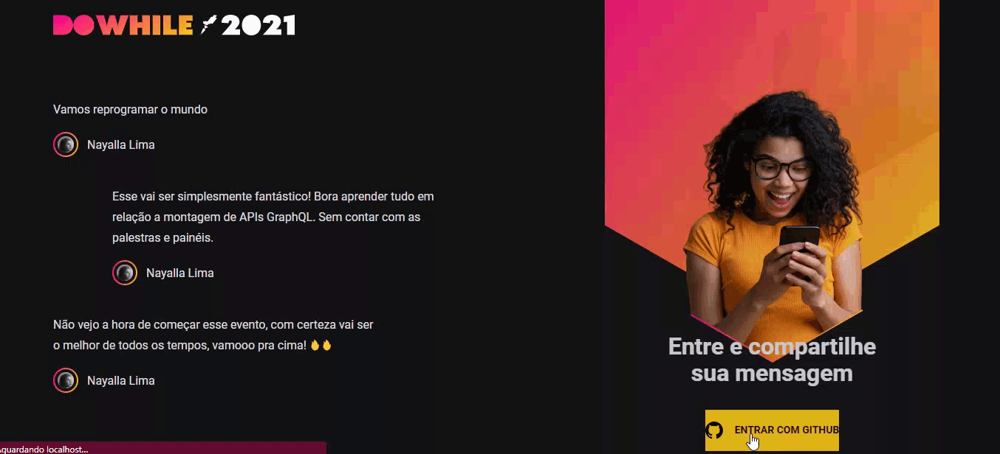

<h1 align="center">   </img></h1>

  
  <a href="#-projeto">Projeto</a>&nbsp;&nbsp;&nbsp;|&nbsp;&nbsp;&nbsp;  
  <a href="#-demonstracao">Demonstração</a>&nbsp;&nbsp;&nbsp;|&nbsp;&nbsp;&nbsp;
  <a href="#-tecnologias-utilizadas">Tecnologias utilizadas</a>&nbsp;&nbsp;&nbsp;|&nbsp;&nbsp;&nbsp;
  <a href="#-layout">Layout</a>&nbsp;&nbsp;&nbsp;|&nbsp;&nbsp;&nbsp;
  <a href="#%EF%B8%8F-executando-a-aplicação">Executando a aplicação</a>&nbsp;&nbsp;&nbsp;|&nbsp;&nbsp;&nbsp;  
  <a href="#-licença">Licença</a>

## 🚩 Projeto

O projeto foi desenvolvido durante a NextLevelWeek Heat da <a href="http://https://rocketseat.com.br//">Rocketseat 🚀</a>. Durante a semana do projeto nós construímos toda a aplicação do zero, fazendo toda a parte do backend e frontend.

Este projeto permite que usuários se conectem para o envio e visualização de mensagens em tempo real.

##  👀 Demonstração

## 💈 Tecnologias utilizadas

- [Node.js](https://nodejs.org/en/)
- [Prisma](https://www.prisma.io/)
- [SQLite](https://www.sqlite.org/index.html)
- [Vite](https://vitejs.dev/)
- [React](https://pt-br.reactjs.org/)
- [TypeScript](https://www.typescriptlang.org/)

## 🎨 Layout

Você pode visualizar o layout do projeto através [desse link](<https://www.figma.com/file/8fwtQO3mfR4ueQLkgvqkaA/%5BNLW-Heat---Mission%3A-Impulse%5D-DoWhile2021-(Community)?node-id=61313%3A4011>). É necessário ter conta no [Figma](http://figma.com/) para acessá-lo.

## ▶️ Executando a aplicação

- Clone o repositório para a sua máquina
  `git clone https://github.com/nayallalima/NLW_Heat.git`
- Instale as dependências com `yarn install`
- Inicie o servidor com o comando `yarn dev`

O app estará disponível no seu browser pelo endereço [`localhost:3000`](http://localhost:3000) do seu navegador.
## 🔒 Licença

---

  Feito com 💜️ por <a href="https://github.com/nayallalima">Nayalla Lima </a>

